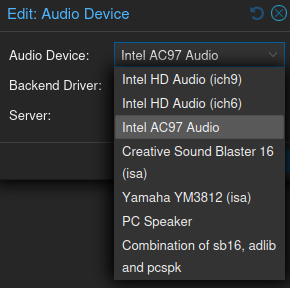
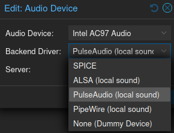
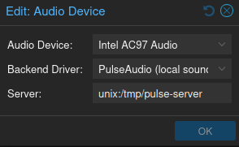

QEMU offers various audio devices and outputs to emulate sound hardware in virtual machines. This page outlines the available audio devices and configuration options for managing audio in QEMU. It supports both modern and older audio devices, ensuring compatibility with many guest operating systems. Additionally, QEMU supports network forwarding for remote audio configurations, allowing audio streams to be forwarded over a network connection.
The WSH PVE patches enable ALSA, PulseAudio and Pipewire with the configuration options outlined in this reference document.

## Audio Devices

The following audio devices are defined in the UI, and the existing Intel devices are fully named to make it easier to understand which driver should be used.

- **sb16**: Creative Sound Blaster 16 (ISA)
- **adlib**: Yamaha YM3812 (ISA)
- **pcspk**: PC Speaker
- **sb16-adlib-pcspk**: A combination of sb16, adlib, and pcspk with a single driver

## Backend driver (audio output)

The additional backend drivers support both local and remote audio output.

- **alsa**: ALSA (local sound)
- **pa**: PulseAudio (local sound)
- **pipewire**: PipeWire (local sound)

## Remote Audio Configuration

The audio server option enables configuring unix sockets for a local audio pipeline, or a remote host.

- server (default value `unix:/tmp/pulse-server`)

A unix socket must already be configured and allow the context pveproxy is running under to connect to it.

Alternatively you can use the tcp, tcp4 or tcp6 protocol prefixes to connect to a remote machine, e.g. tcp:192.168.0.100:4713

## Further reading

- Read [about PulseAudio server strings](https://www.freedesktop.org/wiki/Software/PulseAudio/Documentation/User/ServerStrings/) in the official PulseAudio documentation.
- Read [about PulseAudio network setup](https://www.freedesktop.org/wiki/Software/PulseAudio/Documentation/User/Network/) in the official PulseAudio documentation.
