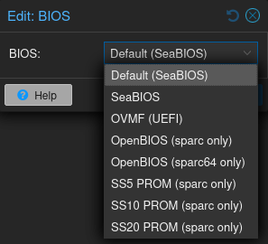

x86_64 and aarch64 can both use OVMF BIOS.
(TODO: aarch64 required AAVMF_CODE from pve-edk2-firmware-aarch64 which has not been added to the dependency section in debian/rules)

Sparc and sparc64 requires either the version of OpenBIOS that matches the architecture bits, or a PROM file.
Generally speaking OpenBIOS is more safe and easier to preconfigure and boot.
However nothing scratches that nostalgic itch quite like seeing the splash logo and POST from SparcStation 5.

There are a few PROM files included but only SS5, SS10 and SS20 seem to be somewhat stable.
They each come with hardware layout expectations that must be followed, see one of the SPARC guides for more information.

## Further reading

- Read [about OpenBIOS](https://github.com/openbios/openbios) in the official OpenBIOS documentation
