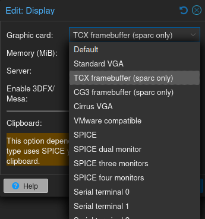
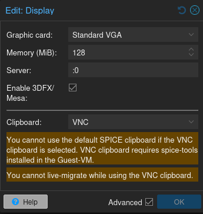

QEMU provides various display devices and options to emulate graphical output in virtual machines. This section outlines the available display devices and configuration options for managing graphical output in QEMU, ensuring compatibility with a wide range of guest operating systems and use cases.
The PVE WSH patches add graphic cards to the UI and adds support for X forwarding via GTK or GL, and an experimental 3DFX/Mesa passthrough option.

## Graphic card options

- tcx: TCX framebuffer (sparc only)
- cg3: CG3 framebuffer (sparc only)
- cirrus: Cirrus VGA - for MSDOS or other very old operating systems that can use a VESA1.2 compatible driver (but are too old to use generic SVGA/VESA2 - TODO: verify and add citation for the last part)

## Server

Unset by default, if it is set to an X display value such as :0 (or 192.168.0.100:0) it will force GTK or SDL output depending on the other options that are set.

## Enable 3DFX/Mesa

Experimental feature - it must be used in conjunction with the 3DFX/MESA drivers in Windows 9x/2000/ME.
TODO: Driver ISO file and further documentation has to be added

## Further reading

- Read [about SPARC platform graphics combinations](https://wiki.qemu.org/Documentation/Platforms/SPARC) in QEMU documentation
